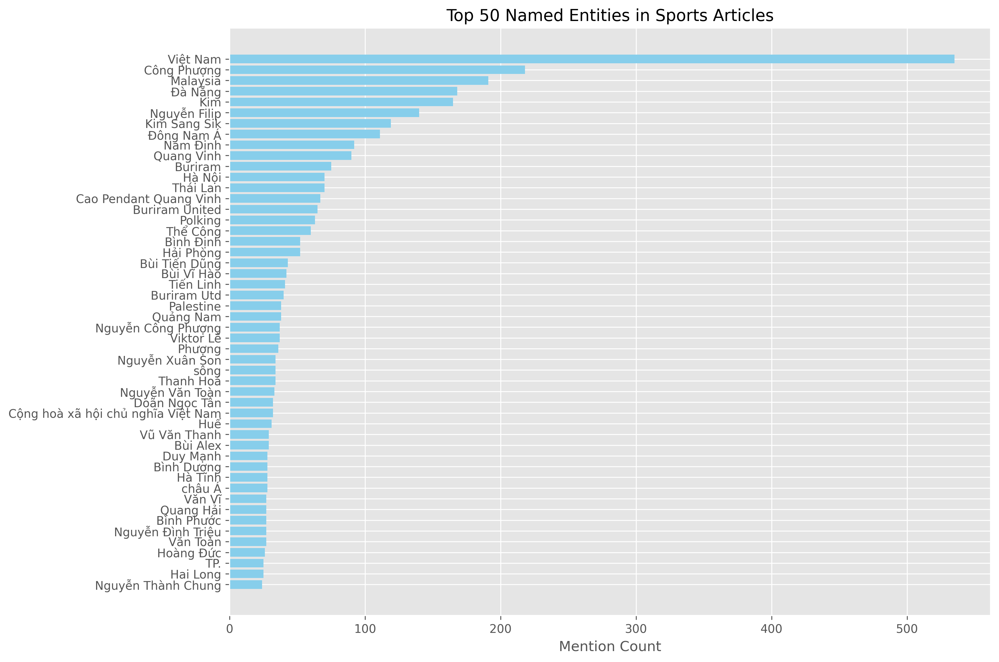

## Setup 

```
	Install Docker
```
## How To Run

**Build docker**
```
	docker build -t baomoi-scraper .
```
**Run docker**
```
	mkdir -p output && docker run -v $(pwd)/output:/app/output baomoi-scraper
```

## Scraper result

All data result in output folder include : article_links.json, entity_distribution.json, entity_distribution.png

**Article Links**

```json
{
  "metadata": {
    "source": "baomoi.com",
    "total_articles": 200
  },
  "articles": [
    {
      "url": "https://baomoi.com/ha-gia-lai-doi-dien-nguy-co-rot-hang-c52311236.epi",
      "title": "HA Gia Lai đối diện nguy cơ rớt hạng",
      "published_at": "2025-05-23T06:31:28"
    },
    {
      "url": "https://baomoi.com/tuyen-viet-nam-san-sang-cho-vong-loai-asian-cup-2027-c52311283.epi",
      "title": "Tuyển Việt Nam sẵn sàng cho vòng loại Asian Cup 2027",
      "published_at": "2025-05-23T06:23:00"
    },
    {
      "url": "https://baomoi.com/vong-24-v-league-2024-2025-da-nang-phai-tu-cuu-lay-minh-c52311259.epi",
      "title": "Vòng 24 V-League 2024 - 2025: Đà Nẵng phải tự cứu lấy mình",
      "published_at": "2025-05-23T06:27:00"
    }
]
}
```
**Analyzer Information**
To analyze the content of articles on the topic of Vietnamese football, I used the VnCoreNLP-1.2 tool to identify the main entities in each sentence such as the name of peoples and positions labeled as B-Per and B-Loc. Then the entities will be calculated for their frequency of appearance in the articles and displayed on the chart.
Entities Information

```json
{
  "metadata": {
    "source": "baomoi.com",
    "total_entities": 50
  },
  "entities": [
    {
      "text": "Việt Nam",
      "type": "LOC",
      "count": 535
    },
    {
      "text": "Công Phượng",
      "type": "PER",
      "count": 218
    },
    {
      "text": "Malaysia",
      "type": "LOC",
      "count": 191
    },
    {
      "text": "Đà Nẵng",
      "type": "LOC",
      "count": 168
    }
]
}
```
Entities distribution chart



